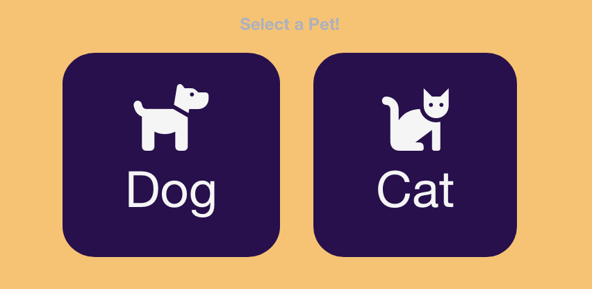
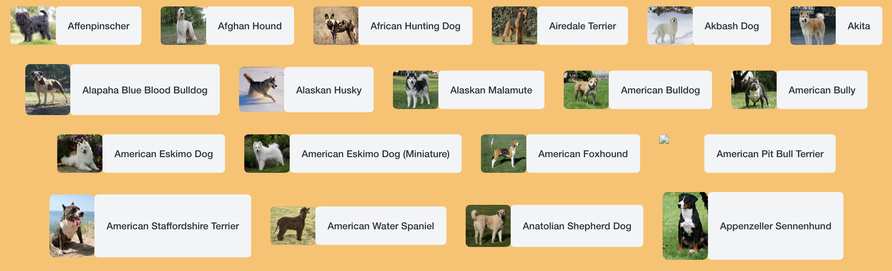
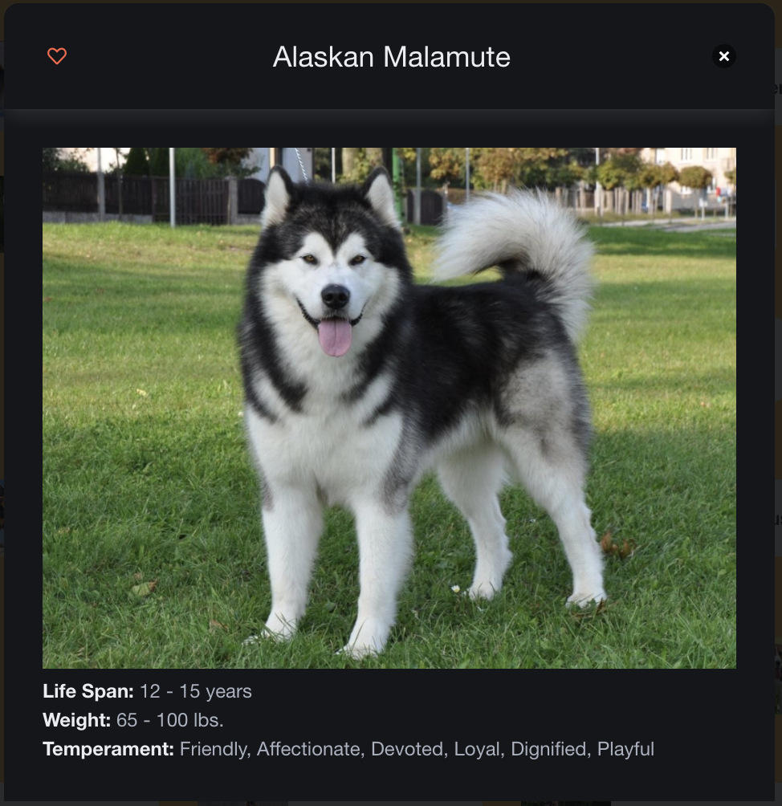
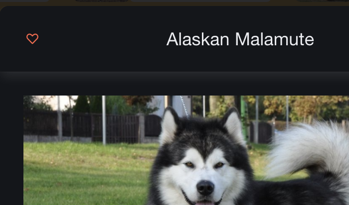
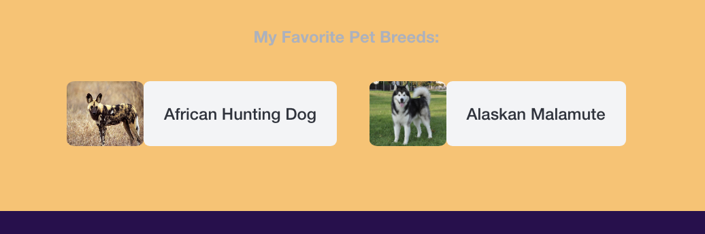
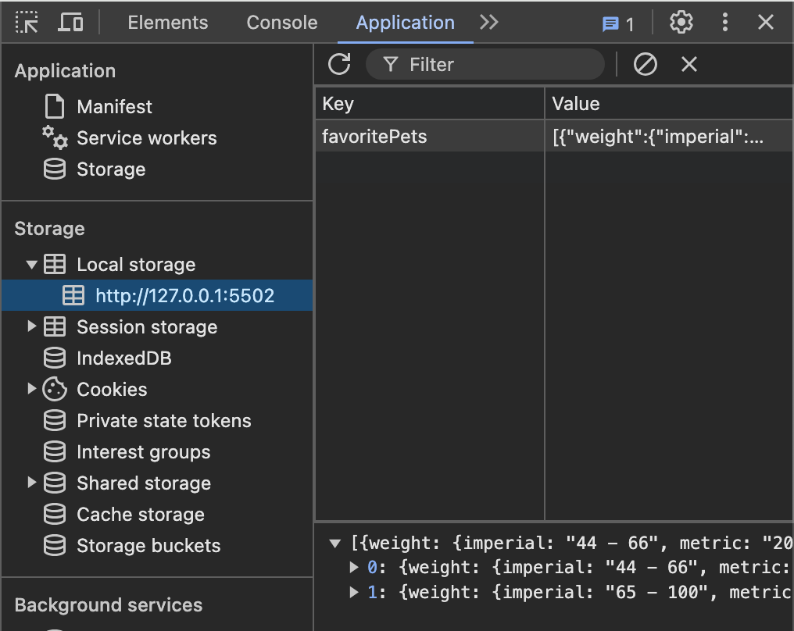
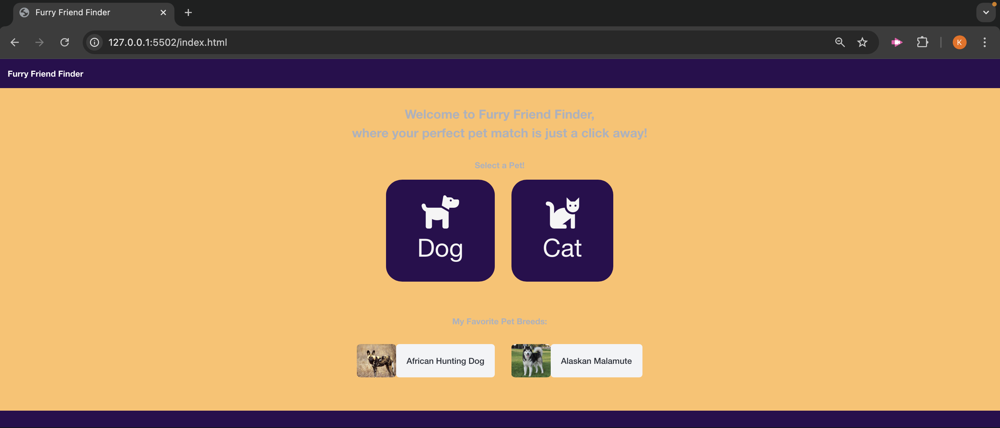
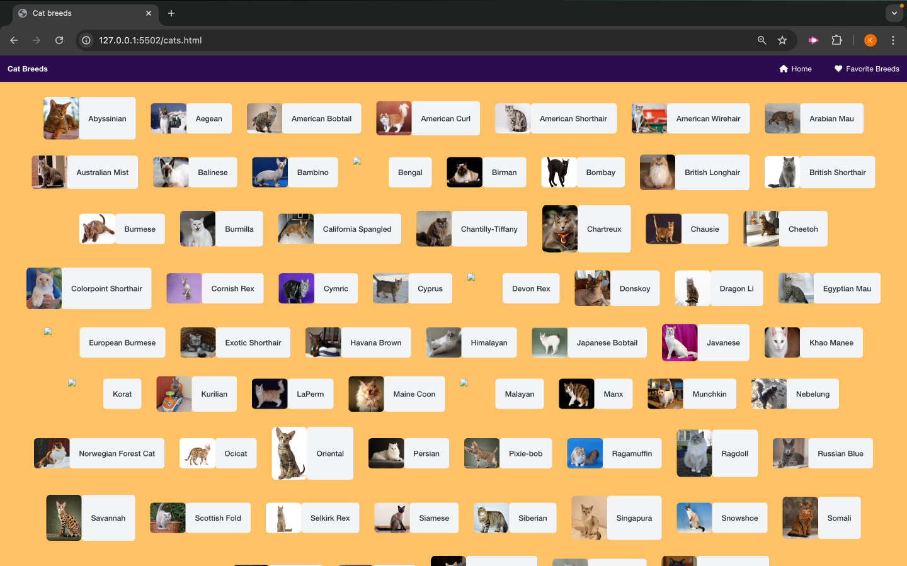
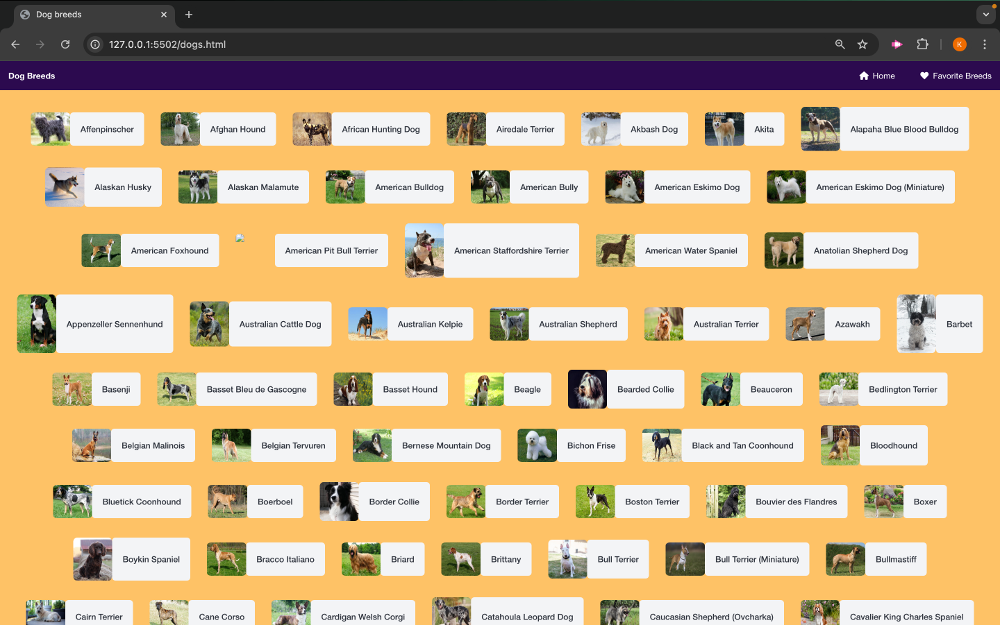

# <Furry-Friend-Finder>

## Description

The purpose of this project was to collaborate within a team to create an interactive front-end website that addressed a real-world problem. The application offers a fun, interactive way for users to choose a pet and learn about different dog and cat breeds.

The application accepts and responds to user input. Users are first prompted to choose between dog breeds or cat breeds from the homepage of the website by clicking on the dog or cat icon. The dog icon leads to a list of dog breeds and the cat icon leads to a list of cat breeds, respectively.

Each breed is represented by a button with a photo of the breed next to it. When users click on a breed button, a modal with a larger picture of the breed and information about the breed’s life span, weight, and temperament are displayed. Users can close the modal by clicking the “x” on the top right side of the modal. Users are able to click a heart icon in the top left-hand corner of the model to favorite a dog or cat breed. Favorited breeds appear on the homepage.

Two server side API’s were used to provide cat and dog breed information. The application uses client-side storage to store persistent data about the user’s favorite pet breeds. The CSS framework library Bulma was used to style and polish the UI of the application. Flexbox was used to make the application responsive and fit the viewports of smaller screens such as mobile devices and tablets.

## Table of Contents

- [Usage](#usage)
- [Application](#application)
- [License](#license)

## Usage

### Users choose a pet by clicking a cat or dog icon

### Users are presented with a list of breeds

### A modal gives more details about the breeds

### Users can favorite a breed by clicking a heart

### Favorite breeds are saved on the homepage

### Information about favorites is saved in local storage

## Application

#### Deployed Website URL:

https://kenzo213.github.io/Animal-Project/

#### Screenshot of Deployed Application

#### Other Credits

The Cat API
https://thecatapi.com/

The Dog API
https://thedogapi.com/

Bulma
https://bulma.io/

edX Curriculum

## License

Please refer to license in repo.
